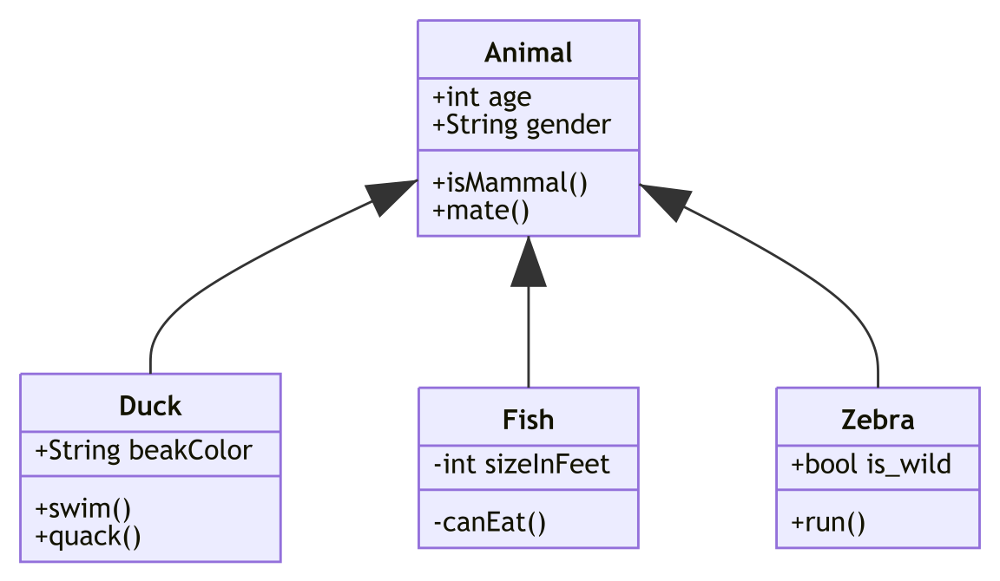

# MermaidJS WL paclet

Wolfram Language (aka Mathematica) paclet for obtaining Mermaid-JS images and graphics.

- Mermaid lets you create diagrams and visualizations using text and code.

- Mermaid has different types of diagrams: Flowchart, Sequence Diagram, Class Diagram, State Diagram, Entity Relationship Diagram, User Journey, Gantt, Pie Chart, Requirement Diagram, and others.

- Mermaid-js is a JavaScript based diagramming and charting tool that renders Markdown-inspired text definitions to create and modify diagrams dynamically.

- `MermaidJS` and `MermaidInk` are very similar; the main difference is in which environment the mermaid-js specifications are converted into images.

- `MermaidInk` uses the Web API mermaid.ink.

- `MermaidJS` uses a local installation of mermaid-cli via the shell program mmdc.

Here is an example:

```mathematica
MermaidInk["
classDiagram
    Animal <|-- Duck
    Animal <|-- Fish
    Animal <|-- Zebra
    Animal : +int age
    Animal : +String gender
    Animal: +isMammal()
    Animal: +mate()
    class Duck{
        +String beakColor
        +swim()
        +quack()
    }
    class Fish{
        -int sizeInFeet
        -canEat()
    }
    class Zebra{
        +bool is_wild
        +run()
    }
"]
```



----

## Flowchart

Here is a diagram that clarifies the execution of `MermaidInk`:

```mermaid
graph TD
UI[/User input/]
MS{{Mermaid-ink server}}
WL{{Wolfram Language}}
WLnb>Notebook]
WLIC[[Input cell]]
WLOC[[Output cell]]
MI[MermaidInk]
UI --> WLIC -.- WLnb
WLIC --> MI -.- WL
MI --> |spec|MS
MS --> |image|MI
MI --> WLOC -.- WLnb
WLnb -.- WL
```